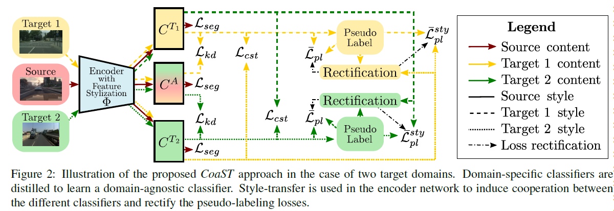

# Cooperative Self-Training for Multi-Target Adaptive Semantic Segmentation

## [[Paper]](https://arxiv.org/abs/2210.01578)

## Abstract

In this work we address multi-target domain adaptation (MTDA) in semantic segmentation, which consists in adapting a single model from an annotated source dataset to multiple unannotated target datasets that differ in their underlying data distributions. To address MTDA, we propose a self-training strategy that employs pseudo-labels to induce cooperation among multiple domain-specific classifiers. We employ feature stylization as an efficient way to generate image views that forms an integral part of self-training. Additionally, to prevent the network from overfitting to noisy pseudo-labels, we devise a rectification strategy that leverages the predictions from different classifiers to estimate the quality of pseudo-labels. Our extensive experiments on numerous settings, based on four different semantic segmentation datasets, validates the effectiveness of the proposed self-training strategy and shows that our method outperforms state-of-the-art MTDA approaches.



## Preparation

### Installation

You may change the cudatoolkit version to yours.

```bash
conda create -n coast python=3.7
conda activate coast
conda install pytorch torchvision torchaudio cudatoolkit -c pytorch
pip install pyyaml==5.4.1 easydict
conda install tqdm scipy
```

### Datasets

By default, the datasets are put in ``<root_dir>/Dataset``. We use symlinks to hook the CoaST codebase to the datasets, i.e. ``ln -s path_GTA5 <root_dir>/Dataset/GTA5``

* **GTA5**: Please follow the instructions [here](https://download.visinf.tu-darmstadt.de/data/from_games/) to download images and semantic segmentation annotations. The GTA5 dataset directory should have this basic structure:

```bash
<root_dir>/Dataset/GTA5/                               % GTA dataset root
<root_dir>/Dataset/GTA5/images/                        % GTA images
<root_dir>/Dataset/GTA5/labels/                        % Semantic segmentation labels
...
```

* **Cityscapes**: Please follow the instructions in [Cityscape](https://www.cityscapes-dataset.com/) to download the images and ground-truths. The Cityscapes dataset directory should have this basic structure:

```bash
<root_dir>/Dataset/Cityscapes/                         % Cityscapes dataset root
<root_dir>/Dataset/Cityscapes/leftImg8bit              % Cityscapes images
<root_dir>/Dataset/Cityscapes/leftImg8bit/train
<root_dir>/Dataset/Cityscapes/leftImg8bit/val
<root_dir>/Dataset/Cityscapes/gtFine                   % Semantic segmentation labels
<root_dir>/Dataset/Cityscapes/gtFine/train
<root_dir>/Dataset/Cityscapes/gtFine/val
...
```

* **Mapillary**: Please follow the instructions in [Mapillary Vistas](https://www.mapillary.com/dataset/vistas) to download the images and validation ground-truths. The Mapillary Vistas dataset directory should have this basic structure:

```bash
<root_dir>/Dataset/Mapillary/                          % Mapillary dataset root
<root_dir>/Dataset/Mapillary/train                     % Mapillary train set
<root_dir>/Dataset/Mapillary/train/images
<root_dir>/Dataset/Mapillary/validation                % Mapillary validation set
<root_dir>/Dataset/Mapillary/validation/images
<root_dir>/Dataset/Mapillary/validation/labels
...
```

* **IDD**: Please follow the instructions in [IDD](https://idd.insaan.iiit.ac.in/) to download the images and validation ground-truths. The IDD Segmentation dataset directory should have this basic structure:

```bash
<root_dir>/Dataset/IDD_Segmentation/                         % IDD dataset root
<root_dir>/Dataset/IDD_Segmentation/leftImg8bit              % IDD images
<root_dir>/Dataset/IDD_Segmentation/leftImg8bit/train
<root_dir>/Dataset/IDD_Segmentation/leftImg8bit/val
<root_dir>/Dataset/IDD_Segmentation/gtFine                   % Semantic segmentation labels
<root_dir>/Dataset/IDD_Segmentation/gtFine/val
...
```

## Pre-trained models

Due to my google drive limits, I can only upload the [checkpoints](https://drive.google.com/drive/u/0/folders/193DynhYYHxMCX7iAOY1Z5DU4b_4T4AHA) for G2CI 7-classes and 19-classes settings.

## Evaluation

### 7-class setting

<details>
  <summary>
    <b>1. Synthetic to Real</b>
  </summary>

- **GTA5 $\rightarrow$ Cityscapes + IDD.**

  ```bash
  python test.py --bs 1 --stage stage1 --resume_path ./logs/stage1_G2CI/from_gta5_to_2_on_deeplabv2_best_model.pkl
  ```
- **GTA5 $\rightarrow$ Cityscapes + Mapillary.**

  ```bash
  python test.py --bs 1 --stage stage1 --src_dataset gta5 --src_rootpath Dataset/GTA5 --tgt_dataset cityscapes mapillary --tgt_rootpath Dataset/Cityscapes Dataset/Mapillary --resume_path ./logs/stage1_G2CM/from_gta5_to_2_on_deeplabv2_best_model.pkl
  ```
- **GTA5 $\rightarrow$ Mapillary + IDD.**

  ```bash
  python test.py --bs 1 --stage stage1 --src_dataset gta5 --src_rootpath Dataset/GTA5 --tgt_dataset mapillary idd --tgt_rootpath Dataset/Mapillary Dataset/IDD_Segmentation --resume_path ./logs/stage1_G2MI/from_gta5_to_2_on_deeplabv2_best_model.pkl
  ```
- **GTA5 $\rightarrow$ Cityscapes + Mapillary + IDD.**

  ```bash
  python test.py --bs 1 --stage stage1 --src_dataset gta5 --src_rootpath Dataset/GTA5 --tgt_dataset cityscapes mapillary idd --tgt_rootpath Dataset/Cityscapes Dataset/Mapillary Dataset/IDD_Segmentation --resume_path ./logs/stage1_G2CMI/from_gta5_to_3_on_deeplabv2_best_model.pkl
  ```

</details>

<details>
  <summary>
    <b>2. Real to Real</b>
  </summary>

- **Cityscapes $\rightarrow$ Mapillary + IDD.**

  ```bash
  python test.py --bs 1 --stage stage1 --src_dataset cityscapes --src_rootpath Dataset/Cityscapes --tgt_dataset mapillary idd --tgt_rootpath Dataset/Mapillary Dataset/IDD_Segmentation --resume_path ./logs/stage1_G2CI/from_cityscapes_to_2_on_deeplabv2_best_model.pkl
  ```
- **IDD $\rightarrow$ Cityscapes + Mapillary.**

  ```bash
  python test.py --bs 1 --stage stage1 --src_dataset idd --src_rootpath Dataset/IDD_Segmentation --tgt_dataset cityscapes mapillary --tgt_rootpath Dataset/Cityscapes Dataset/Mapillary --resume_path ./logs/stage1_G2CI/from_idd_to_2_on_deeplabv2_best_model.pkl
  ```
- **Mapillary $\rightarrow$ Cityscapes + IDD.**

  ```bash
  python test.py --bs 1 --stage stage1 --src_dataset mapillary --src_rootpath Dataset/Mapillary --tgt_dataset cityscapes idd --tgt_rootpath Dataset/Cityscapes Dataset/IDD_Segmentation --resume_path ./logs/stage1_G2CI/from_mapillary_to_2_on_deeplabv2_best_model.pkl
  ```

</details>

### 19-class setting

<details>
  <summary>
    <b>1. Synthetic to Real</b>
  </summary>

- **GTA5 $\rightarrow$ Cityscapes + IDD.**

  ```bash
  python test.py --bs 1 --n_class 19 --img_size '1024,512' --resize 1024 --rcrop '512,256' --stage stage1 --resume_path ./logs/stage1_G2CI_19/from_gta5_to_2_on_deeplabv2_best_model.pkl
  ```
- **GTA5 $\rightarrow$ Cityscapes + Mapillary.**

  ```bash
  python test.py --bs 1 --n_class 19 --img_size '1024,512' --resize 1024 --rcrop '512,256' --stage stage1 --src_dataset gta5 --src_rootpath Dataset/GTA5 --tgt_dataset cityscapes mapillary --tgt_rootpath Dataset/Cityscapes Dataset/Mapillary --resume_path ./logs/stage1_G2CM_19/from_gta5_to_2_on_deeplabv2_best_model.pkl
  ```
- **GTA5 $\rightarrow$ Mapillary + IDD.**

  ```bash
  python test.py --bs 1 --n_class 19 --img_size '1024,512' --resize 1024 --rcrop '512,256' --stage stage1 --src_dataset gta5 --src_rootpath Dataset/GTA5 --tgt_dataset mapillary idd --tgt_rootpath Dataset/Mapillary Dataset/IDD_Segmentation --resume_path ./logs/stage1_G2MI_19/from_gta5_to_2_on_deeplabv2_best_model.pkl
  ```
- **GTA5 $\rightarrow$ Cityscapes + Mapillary + IDD.**

  ```bash
  python test.py --bs 1 --n_class 19 --img_size '1024,512' --resize 1024 --rcrop '512,256' --stage stage1 --src_dataset gta5 --src_rootpath Dataset/GTA5 --tgt_dataset cityscapes mapillary idd --tgt_rootpath Dataset/Cityscapes Dataset/Mapillary Dataset/IDD_Segmentation --resume_path ./logs/stage1_G2CMI_19/from_gta5_to_3_on_deeplabv2_best_model.pkl
  ```

</details>

<details>
  <summary>
    <b>2. Real to Real</b>
  </summary>

- **Cityscapes $\rightarrow$ Mapillary + IDD.**

  ```bash
  python test.py --bs 1 --n_class 19 --img_size '1024,512' --resize 1024 --rcrop '512,256' --stage stage1 --src_dataset cityscapes --src_rootpath Dataset/Cityscapes --tgt_dataset mapillary idd --tgt_rootpath Dataset/Mapillary Dataset/IDD_Segmentation --resume_path ./logs/stage1_G2CI_19/from_cityscapes_to_2_on_deeplabv2_best_model.pkl
  ```
- **IDD $\rightarrow$ Cityscapes + Mapillary.**

  ```bash
  python test.py --bs 1 --n_class 19 --img_size '1024,512' --resize 1024 --rcrop '512,256' --stage stage1 --src_dataset idd --src_rootpath Dataset/IDD_Segmentation --tgt_dataset cityscapes mapillary --tgt_rootpath Dataset/Cityscapes Dataset/Mapillary --resume_path ./logs/stage1_G2CI_19/from_idd_to_2_on_deeplabv2_best_model.pkl
  ```
- **Mapillary $\rightarrow$ Cityscapes + IDD.**

  ```bash
  python test.py --bs 1 --n_class 19 --img_size '1024,512' --resize 1024 --rcrop '512,256' --stage stage1 --src_dataset mapillary --src_rootpath Dataset/Mapillary --tgt_dataset cityscapes idd --tgt_rootpath Dataset/Cityscapes Dataset/IDD_Segmentation --resume_path ./logs/stage1_G2CI_19/from_mapillary_to_2_on_deeplabv2_best_model.pkl
  ```

</details>

## Training

To ensure reproduction, the random seed has been fixed in the code. Still, you may need to train a few times to reach the comparable performance.

### 7-class setting

<details>
  <summary>
    <b>1. Synthetic to Real</b>
  </summary>

- **GTA5 $\rightarrow$ Cityscapes + IDD.**

  * Warm up.

  ```bash
  python train.py --name warmup_G2CI --stage warm_up --freeze_bn --gan Vanilla --lr 2.5e-4 --adv 0.001 --no_resume
  ```

  * Self-training.

  ```bash
  python train.py --name stage1_G2CI --used_save_pseudo --rectify --resume_path ./logs/warmup_G2CI/from_gta5_to_2_on_deeplabv2_current_model.pkl
  ```
- **GTA5 $\rightarrow$ Cityscapes + Mapillary.**

  * Warm up.

  ```bash
  python train.py --name warmup_G2CM --src_dataset gta5 --src_rootpath Dataset/GTA5 --tgt_dataset cityscapes mapillary --tgt_rootpath Dataset/Cityscapes Dataset/Mapillary --stage warm_up --freeze_bn --gan Vanilla --lr 2.5e-4 --adv 0.001 --no_resume
  ```

  * Self-training.

  ```bash
  python train.py --name stage1_G2CM --src_dataset gta5 --src_rootpath Dataset/GTA5 --tgt_dataset cityscapes mapillary --tgt_rootpath Dataset/Cityscapes Dataset/Mapillary --used_save_pseudo --rectify --resume_path ./logs/warmup_G2CM/from_gta5_to_2_on_deeplabv2_current_model.pkl
  ```
- **GTA5 $\rightarrow$ Mapillary + IDD.**

  * Warm up.

  ```bash
  python train.py --name warmup_G2MI --src_dataset gta5 --src_rootpath Dataset/GTA5 --tgt_dataset mapillary idd --tgt_rootpath Dataset/Mapillary Dataset/IDD_Segmentation --stage warm_up --freeze_bn --gan Vanilla --lr 2.5e-4 --adv 0.001 --no_resume
  ```

  * Self-training.

  ```bash
  python train.py --name stage1_G2MI --src_dataset gta5 --src_rootpath Dataset/GTA5 --tgt_dataset mapillary idd --tgt_rootpath Dataset/Mapillary Dataset/IDD_Segmentation --used_save_pseudo --rectify --resume_path ./logs/warmup_G2MI/from_gta5_to_2_on_deeplabv2_current_model.pkl
  ```
- **GTA5 $\rightarrow$ Cityscapes + Mapillary + IDD.**

  * Warm up.

  ```bash
  python train.py --name warmup_G2CMI --src_dataset gta5 --src_rootpath Dataset/GTA5 --tgt_dataset cityscapes mapillary idd --tgt_rootpath Dataset/Cityscapes Dataset/Mapillary Dataset/IDD_Segmentation --stage warm_up --freeze_bn --gan Vanilla --lr 2.5e-4 --adv 0.001 --no_resume
  ```

  * Self-training.

  ```bash
  python train.py --name stage1_G2CMI --src_dataset gta5 --src_rootpath Dataset/GTA5 --tgt_dataset cityscapes mapillary idd --tgt_rootpath Dataset/Cityscapes Dataset/Mapillary Dataset/IDD_Segmentation --used_save_pseudo --rectify --resume_path ./logs/warmup_G2CMI/from_gta5_to_3_on_deeplabv2_current_model.pkl
  ```

</details>

<details>
  <summary>
    <b>2. Real to Real</b>
  </summary>

- **Cityscapes $\rightarrow$ Mapillary + IDD.**

  * Warm up.

  ```bash
  python train.py --name warmup_C2MI --src_dataset cityscapes --src_rootpath Dataset/Cityscapes --tgt_dataset mapillary idd --tgt_rootpath Dataset/Mapillary Dataset/IDD_Segmentation --stage warm_up --freeze_bn --gan Vanilla --lr 2.5e-4 --adv 0.001 --no_resume
  ```

  * Self-training.

  ```bash
  python train.py --name stage1_C2MI --src_dataset cityscapes --src_rootpath Dataset/Cityscapes --tgt_dataset mapillary idd --tgt_rootpath Dataset/Mapillary Dataset/IDD_Segmentation --used_save_pseudo --rectify --resume_path ./logs/warmup_C2MI/from_cityscapes_to_2_on_deeplabv2_current_model.pkl
  ```
- **IDD $\rightarrow$ Cityscapes + Mapillary.**

  * Warm up.

  ```bash
  python train.py --name warmup_I2CM --src_dataset idd --src_rootpath Dataset/IDD_Segmentation --tgt_dataset cityscapes mapillary --tgt_rootpath Dataset/Cityscapes Dataset/Mapillary --stage warm_up --freeze_bn --gan Vanilla --lr 2.5e-4 --adv 0.001 --no_resume
  ```

  * Self-training.

  ```bash
  python train.py --name stage1_I2CM --src_dataset idd --src_rootpath Dataset/IDD_Segmentation --tgt_dataset cityscapes mapillary --tgt_rootpath Dataset/Cityscapes Dataset/Mapillary --used_save_pseudo --rectify --resume_path ./logs/warmup_I2CM/from_idd_to_2_on_deeplabv2_current_model.pkl
  ```
- **Mapillary $\rightarrow$ Cityscapes + IDD.**

  * Warm up.

  ```bash
  python train.py --name warmup_M2CI --src_dataset mapillary --src_rootpath Dataset/Mapillary --tgt_dataset cityscapes idd --tgt_rootpath Dataset/Cityscapes Dataset/IDD_Segmentation --stage warm_up --freeze_bn --gan Vanilla --lr 2.5e-4 --adv 0.001 --no_resume
  ```

  * Self-training.

  ```bash
  python train.py --name stage1_M2CI --src_dataset mapillary --src_rootpath Dataset/Mapillary --tgt_dataset cityscapes idd --tgt_rootpath Dataset/Cityscapes Dataset/IDD_Segmentation --used_save_pseudo --rectify --resume_path ./logs/warmup_M2CI/from_mapillary_to_2_on_deeplabv2_current_model.pkl
  ```

</details>

### 19-class setting

<details>
  <summary>
    <b>1. Synthetic to Real</b>
  </summary>

- **GTA5 $\rightarrow$ Cityscapes + IDD.**

  * Warm up.

  ```bash
  python train.py --name warmup_G2CI_19 --n_class 19 --img_size '1024,512' --resize 1024 --rcrop '512,256' --stage warm_up --freeze_bn --gan Vanilla --lr 2.5e-4 --adv 0.001 --no_resume
  ```

  * Self-training.

  ```bash
  python train.py --name stage1_G2CI_19 --n_class 19 --img_size '1024,512' --resize 1024 --rcrop '512,256' --used_save_pseudo --rectify --resume_path ./logs/warmup_G2CI_19/from_gta5_to_2_on_deeplabv2_current_model.pkl
  ```
- **GTA5 $\rightarrow$ Cityscapes + Mapillary.**

  * Warm up.

  ```bash
  python train.py --name warmup_G2CM_19 --n_class 19 --img_size '1024,512' --resize 1024 --rcrop '512,256' --src_dataset gta5 --src_rootpath Dataset/GTA5 --tgt_dataset cityscapes mapillary --tgt_rootpath Dataset/Cityscapes Dataset/Mapillary --stage warm_up --freeze_bn --gan Vanilla --lr 2.5e-4 --adv 0.001 --no_resume
  ```

  * Self-training.

  ```bash
  python train.py --name stage1_G2CM_19 --n_class 19 --img_size '1024,512' --resize 1024 --rcrop '512,256' --src_dataset gta5 --src_rootpath Dataset/GTA5 --tgt_dataset cityscapes mapillary --tgt_rootpath Dataset/Cityscapes Dataset/Mapillary --used_save_pseudo --rectify --resume_path ./logs/warmup_G2CM_19/from_gta5_to_2_on_deeplabv2_current_model.pkl
  ```
- **GTA5 $\rightarrow$ Mapillary + IDD.**

  * Warm up.

  ```bash
  python train.py --name warmup_G2MI_19 --n_class 19 --img_size '1024,512' --resize 1024 --rcrop '512,256' --src_dataset gta5 --src_rootpath Dataset/GTA5 --tgt_dataset mapillary idd --tgt_rootpath Dataset/Mapillary Dataset/IDD_Segmentation --stage warm_up --freeze_bn --gan Vanilla --lr 2.5e-4 --adv 0.001 --no_resume
  ```

  * Self-training.

  ```bash
  python train.py --name stage1_G2MI_19 --n_class 19 --img_size '1024,512' --resize 1024 --rcrop '512,256' --src_dataset gta5 --src_rootpath Dataset/GTA5 --tgt_dataset mapillary idd --tgt_rootpath Dataset/Mapillary Dataset/IDD_Segmentation --used_save_pseudo --rectify --resume_path ./logs/warmup_G2MI/from_gta5_to_2_on_deeplabv2_current_model.pkl
  ```
- **GTA5 $\rightarrow$ Cityscapes + Mapillary + IDD.**

  * Warm up.

  ```bash
  python train.py --name warmup_G2CMI_19 --n_class 19 --img_size '1024,512' --resize 1024 --rcrop '512,256' --src_dataset gta5 --src_rootpath Dataset/GTA5 --tgt_dataset cityscapes mapillary idd --tgt_rootpath Dataset/Cityscapes Dataset/Mapillary Dataset/IDD_Segmentation --stage warm_up --freeze_bn --gan Vanilla --lr 2.5e-4 --adv 0.001 --no_resume
  ```

  * Self-training.

  ```bash
  python train.py --name stage1_G2CMI_19 --n_class 19 --img_size '1024,512' --resize 1024 --rcrop '512,256' --src_dataset gta5 --src_rootpath Dataset/GTA5 --tgt_dataset cityscapes mapillary idd --tgt_rootpath Dataset/Cityscapes Dataset/Mapillary Dataset/IDD_Segmentation --used_save_pseudo --rectify --resume_path ./logs/warmup_G2CMI/from_gta5_to_3_on_deeplabv2_current_model.pkl
  ```

</details>

<details>
  <summary>
    <b>2. Real to Real</b>
  </summary>

- **Cityscapes $\rightarrow$ Mapillary + IDD.**

  * Warm up.

  ```bash
  python train.py --name warmup_C2MI_19 --n_class 19 --img_size '1024,512' --resize 1024 --rcrop '512,256'  --src_dataset cityscapes --src_rootpath Dataset/Cityscapes --tgt_dataset mapillary idd --tgt_rootpath Dataset/Mapillary Dataset/IDD_Segmentation --stage warm_up --freeze_bn --gan Vanilla --lr 2.5e-4 --adv 0.001 --no_resume
  ```

  * Self-training.

  ```bash
  python train.py --name stage1_C2MI_19 --n_class 19 --img_size '1024,512' --resize 1024 --rcrop '512,256'  --src_dataset cityscapes --src_rootpath Dataset/Cityscapes --tgt_dataset mapillary idd --tgt_rootpath Dataset/Mapillary Dataset/IDD_Segmentation --used_save_pseudo --rectify --resume_path ./logs/warmup_C2MI_19/from_cityscapes_to_2_on_deeplabv2_current_model.pkl
  ```
- **IDD $\rightarrow$ Cityscapes + Mapillary.**

  * Warm up.

  ```bash
  python train.py --name warmup_I2CM_19 --n_class 19 --img_size '1024,512' --resize 1024 --rcrop '512,256'  --src_dataset idd --src_rootpath Dataset/IDD_Segmentation --tgt_dataset cityscapes mapillary --tgt_rootpath Dataset/Cityscapes Dataset/Mapillary --stage warm_up --freeze_bn --gan Vanilla --lr 2.5e-4 --adv 0.001 --no_resume
  ```

  * Self-training.

  ```bash
  python train.py --name stage1_I2CM_19 --n_class 19 --img_size '1024,512' --resize 1024 --rcrop '512,256'  --src_dataset idd --src_rootpath Dataset/IDD_Segmentation --tgt_dataset cityscapes mapillary --tgt_rootpath Dataset/Cityscapes Dataset/Mapillary --used_save_pseudo --rectify --resume_path ./logs/warmup_I2CM_19/from_idd_to_2_on_deeplabv2_current_model.pkl
  ```
- **Mapillary $\rightarrow$ Cityscapes + IDD.**

  * Warm up.

  ```bash
  python train.py --name warmup_M2CI_19 --n_class 19 --img_size '1024,512' --resize 1024 --rcrop '512,256'  --src_dataset mapillary --src_rootpath Dataset/Mapillary --tgt_dataset cityscapes idd --tgt_rootpath Dataset/Cityscapes Dataset/IDD_Segmentation --stage warm_up --freeze_bn --gan Vanilla --lr 2.5e-4 --adv 0.001 --no_resume
  ```

  * Self-training.

  ```bash
  python train.py --name stage1_M2CI_19 --n_class 19 --img_size '1024,512' --resize 1024 --rcrop '512,256'  --src_dataset mapillary --src_rootpath Dataset/Mapillary --tgt_dataset cityscapes idd --tgt_rootpath Dataset/Cityscapes Dataset/IDD_Segmentation --used_save_pseudo --rectify --resume_path ./logs/warmup_M2CI_19/from_mapillary_to_2_on_deeplabv2_current_model.pkl
  ```

</details>

## Acknowledgements

This codebase is heavily borrowed from [MTAF](https://github.com/valeoai/MTAF) and [ProDA](https://github.com/microsoft/ProDA).
